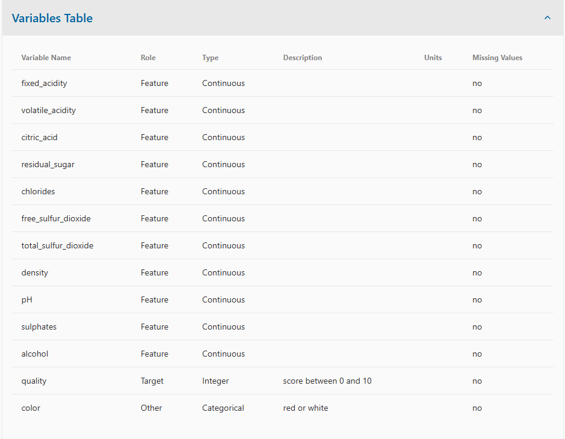

#### Project4
# Group 1 Project 4 - 

## 

### Introduction
Problem Statement:
VinoVista, a renowned winery, is committed to producing consistently exceptional wines. However, they have observed variability in the quality of their white wine batches. To address this challenge, VinoVista seeks a predictive model that can accurately assess the quality of wine batches based on their chemical properties before bottling.
Project Goal:
The primary objective of this project is to develop a robust machine learning model capable of predicting wine quality on a scale of 0-10. This model will utilize a dataset containing various chemical properties of wine, such as acidity, pH, residual sugar, chlorides, free sulfur dioxide, total sulfur dioxide, density, sulfates, and alcohol content.


### Project Scope and Criteria


### ETL Project Guidelines:


### Visualization for Data Exploration


#### Key Metrics in this data



#### Collaborators:
```yaml
Chuck Bui
Jack Jeffries
Beau Massie
Christopher Turner
```

### Proposed Technologies:
```yaml
Programming Language: Python (Jupyter Notebook, Pandas Library, SckitLearn)

```

### This repo contains the following files:
```yaml
    root\
    - wine_quality.ipynb - the Jupyter Notebook file with our code for the project
    - 
    - README.md

    resources\
    - 
    - 

    data\
    - winequality-white.csv - dataset for the data science job market
```


### Resources, Cites
- *Wine Quality* - Dataset from UC Irvine Machine Learning Repository - https://archive.ics.uci.edu/dataset/186/wine+quality 
